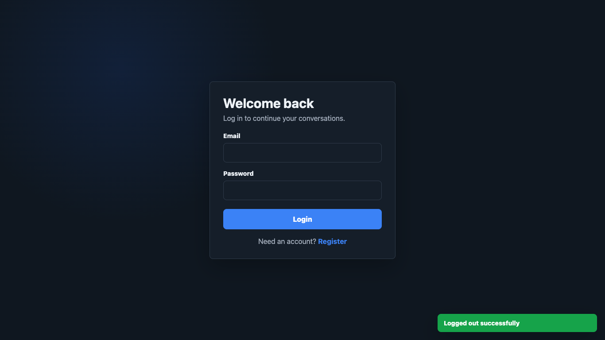
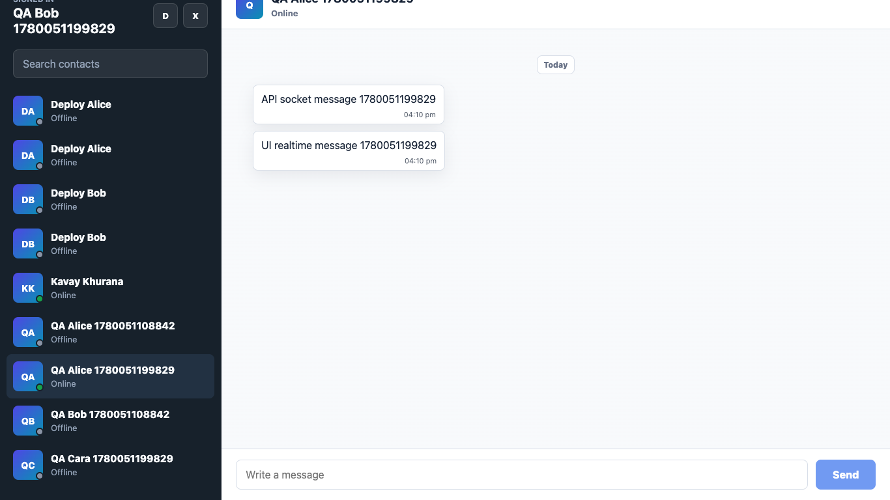

# ChatApp

ChatApp is a deployed full-stack one-to-one real-time chat application for direct human-to-human messaging. It is built with React, Vite, Node.js, Express.js, Socket.io, and PostgreSQL, with JWT authentication, active contact discovery, typing indicators, persisted chat history, read receipts, dark mode, toast notifications, and responsive mobile navigation.

The application is intentionally focused on private direct messaging. It does not include group chats, file sharing, calls, reactions, push notifications, model API integrations, or additional queue/cache infrastructure.

## Key Features

- Register, login, logout, and restore sessions from local storage.
- One-to-one messaging with messages persisted in PostgreSQL.
- Real-time message delivery through Socket.io when both users are online.
- Sidebar contact list shows only currently active online users.
- Search filters active contacts instantly on the client.
- Online/offline indicators, typing indicators, read receipts, and timestamps.
- Chat history loads in chronological order with date separators.
- Dark mode preference is stored locally and applied on reload.
- Toast notifications for auth, logout, send failures, and network errors.
- Responsive layout switches between sidebar and chat view on mobile.

## Live Deployment

- Frontend: [https://chatapp-kavay.netlify.app](https://chatapp-kavay.netlify.app)
- Backend health check: [https://backend-production-98b4.up.railway.app/health](https://backend-production-98b4.up.railway.app/health)
- Repository: [https://github.com/Kavaykhurana/chatApp](https://github.com/Kavaykhurana/chatApp)

## How To Use

1. Open the live frontend.
2. Register or log in.
3. Ask another person to register and stay online.
4. Their account appears in the sidebar only while they are active.
5. Select their name and send a message.
6. If they are online, messages, typing status, and read updates appear in real time.

To test alone, open the app in two browser profiles or one normal window plus one private/incognito window. Register a different account in each window, then send messages between them.

## Tech Stack

- Frontend: React, Vite, Context API, Axios, Socket.io Client, plain CSS
- Backend: Node.js, Express.js, Socket.io, JWT, bcryptjs
- Database: PostgreSQL, compatible with Supabase Postgres
- Deployment targets: Railway or Render for backend, Vercel or Netlify for frontend, Supabase for PostgreSQL

## Project Structure

```text
chatApp/
├── backend/
│   ├── config/
│   │   ├── cors.js
│   │   └── db.js
│   ├── controllers/
│   │   ├── authController.js
│   │   └── messageController.js
│   ├── middleware/
│   │   ├── authMiddleware.js
│   │   └── errorMiddleware.js
│   ├── routes/
│   │   ├── authRoutes.js
│   │   └── messageRoutes.js
│   ├── socket/
│   │   └── socketHandler.js
│   ├── sql/
│   │   ├── schema.sql
│   │   └── supabase-chat-app-schema.sql
│   ├── .env.example
│   ├── package.json
│   └── server.js
├── docs/
│   └── screenshots/
│       ├── chat.png
│       └── login.png
├── frontend/
│   ├── public/
│   ├── src/
│   │   ├── api/
│   │   ├── components/
│   │   ├── context/
│   │   ├── hooks/
│   │   ├── pages/
│   │   ├── App.jsx
│   │   ├── index.css
│   │   └── main.jsx
│   ├── .env.example
│   ├── .env.production
│   ├── package.json
│   └── vite.config.js
├── netlify.toml
├── render.yaml
└── README.md
```

## Local Setup

### 1. Create the database

Create a PostgreSQL database named `chat_app`, then run:

```bash
psql -d chat_app -f backend/sql/schema.sql
```

### 2. Configure backend environment

Copy the backend environment file:

```bash
cp backend/.env.example backend/.env
```

Backend variables:

| Variable | Description |
| --- | --- |
| `PORT` | Express server port. |
| `DB_HOST` | PostgreSQL host for local database connections. |
| `DB_PORT` | PostgreSQL port. |
| `DB_USER` | PostgreSQL username. |
| `DB_PASSWORD` | PostgreSQL password. |
| `DB_NAME` | PostgreSQL database name. |
| `DATABASE_URL` | Optional hosted PostgreSQL connection string, useful for Supabase and Render. |
| `DB_SSL` | Set to `true` for hosted databases requiring SSL. |
| `DB_SCHEMA` | Optional PostgreSQL schema. Use `chat_app` when sharing an existing Supabase project safely. |
| `JWT_SECRET` | Long random secret used to sign JWTs. |
| `JWT_EXPIRES_IN` | JWT lifetime, for example `7d`. |
| `CLIENT_URL` | Frontend origin allowed by CORS and Socket.io. Use a comma-separated list for local plus deployed origins. |

### 3. Configure frontend environment

Copy the frontend environment file:

```bash
cp frontend/.env.example frontend/.env
```

Frontend variables:

| Variable | Description |
| --- | --- |
| `VITE_API_URL` | Backend API base URL ending in `/api`. |
| `VITE_SOCKET_URL` | Backend Socket.io server URL. |

Production defaults are committed in `frontend/.env.production` and mirrored in `netlify.toml` so production builds point at the deployed Railway backend instead of local URLs.

### 4. Install and run backend

```bash
cd backend
npm install
npm run dev
```

### 5. Install and run frontend

```bash
cd frontend
npm install
npm run dev
```

Open the Vite URL shown in the terminal.

## REST API Reference

| Method | Endpoint | Auth | Description | Body |
| --- | --- | --- | --- | --- |
| `POST` | `/api/auth/register` | No | Register a user and return JWT plus user info. | `{ "name": "Ava", "email": "ava@example.com", "password": "secret12" }` |
| `POST` | `/api/auth/login` | No | Log in and return JWT plus user info. | `{ "email": "ava@example.com", "password": "secret12" }` |
| `GET` | `/api/messages/users` | Yes | Return all users except the authenticated user. The frontend displays only users currently reported online by Socket.io. | None |
| `GET` | `/api/messages/:userId` | Yes | Return full chat history with selected user, ordered oldest first. | None |
| `POST` | `/api/messages/send/:receiverId` | Yes | Persist a message and emit `newMessage` to the receiver if online. | `{ "message": "Hello" }` |
| `PATCH` | `/api/messages/read/:userId` | Yes | Mark unread messages from a sender as read. | None |

Authenticated requests must include:

```text
Authorization: Bearer <token>
```

## Socket.io Event Reference

| Event | Direction | Payload | Description |
| --- | --- | --- | --- |
| `connection` | Client to server | `auth: { userId }` | Registers the user in the online user map. |
| `getOnlineUsers` | Server to client | `[1, 2, 3]` | Broadcasts the full online user id list. |
| `sendMessage` | Client to server | `{ receiverId, message }` | Emits an already persisted message object to the receiver. |
| `newMessage` | Server to client | `{ id, sender_id, receiver_id, message, is_read, created_at }` | Delivers a real-time message. |
| `typing` | Client to server | `{ receiverId }` | Notifies a receiver that the sender is typing. |
| `userTyping` | Server to client | `{ senderId }` | Shows typing status for the sender. |
| `stopTyping` | Client to server | `{ receiverId }` | Notifies a receiver that the sender stopped typing. |
| `userStopTyping` | Server to client | `{ senderId }` | Hides typing status for the sender. |
| `disconnect` | Client to server | None | Removes the user from the online user map. |

## Deployment Notes

### Supabase PostgreSQL

1. Create a Supabase project, or use a dedicated schema in an existing project.
2. For a dedicated project, open the SQL editor and run `backend/sql/schema.sql`.
3. For an existing shared project, run `backend/sql/supabase-chat-app-schema.sql` and set `DB_SCHEMA=chat_app` on the backend.
4. Copy the project database connection string.
5. Set backend environment variables:
   - `DATABASE_URL=<supabase_connection_string>`
   - `DB_SSL=true`
   - `DB_SCHEMA=chat_app` if you used the shared-project schema file

The app uses its own JWT authentication and database tables. It does not use Supabase Auth or Supabase Realtime.

### Railway Backend

1. Create a Railway project and deploy the `backend` directory.
2. Set the start command to `npm start`.
3. Add the hosted PostgreSQL variables:
   - `DATABASE_URL=<supabase_connection_string>`
   - `DB_SSL=true`
   - `DB_SCHEMA=chat_app` if the shared Supabase schema file was used
4. Add authentication and client variables:
   - `JWT_SECRET=<strong_random_secret>`
   - `JWT_EXPIRES_IN=7d`
   - `CLIENT_URL=<deployed_frontend_origin>`
   - `NODE_ENV=production`
5. Generate a Railway public domain and use it for the frontend `VITE_API_URL` and `VITE_SOCKET_URL`.

### Render Backend

1. Create a new Blueprint or Web Service from the GitHub repository.
2. If using the included `render.yaml`, Render reads `rootDir: backend`, `buildCommand: npm install`, and `startCommand: npm start`.
3. Add `DATABASE_URL` from Supabase.
4. Set `CLIENT_URL` to the deployed frontend origin. To support local and production at the same time, use a comma-separated value such as `http://localhost:5173,https://your-app.vercel.app`.
5. Keep `DB_SSL=true` for Supabase.
6. Keep `DB_SCHEMA=chat_app` if the schema was applied to an existing Supabase project.

### Vercel Frontend

1. Create a new Vercel project from the GitHub repository.
2. Set root directory to `frontend`.
3. Build command: `npm run build`.
4. Output directory: `dist`.
5. Add `VITE_API_URL` and `VITE_SOCKET_URL` pointing to the deployed backend.

### Netlify Frontend

1. Create a new Netlify site from the GitHub repository.
2. Base directory: `frontend`.
3. Build command: `npm run build`.
4. Publish directory: `frontend/dist`.
5. Keep `VITE_API_URL` and `VITE_SOCKET_URL` in `netlify.toml` pointed at the deployed backend.

## Verification

The deployed application has been checked against the public Netlify and Railway URLs. The verification covered:

- Frontend production build with `npm run build`.
- Railway backend health endpoint.
- Register/login/logout and JWT-protected routes.
- Active-only contact rendering.
- Sidebar search empty state.
- Real-time Socket.io connection, online user broadcast, typing, stop typing, and new message delivery.
- Message persistence, chat history, and read receipt updates.
- Dark mode toggle and responsive mobile sidebar/chat navigation.

## Screenshots

### Login



### Real-Time Chat


